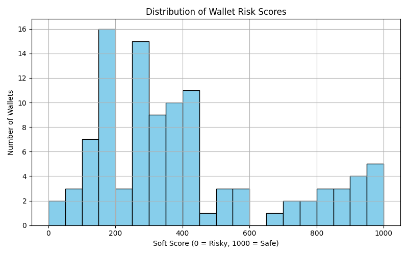
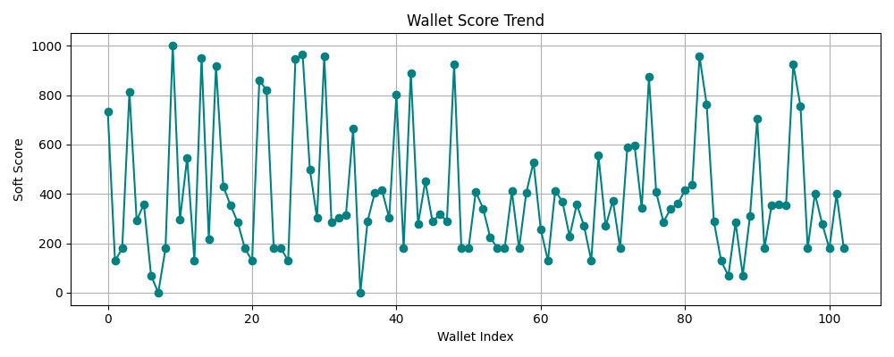
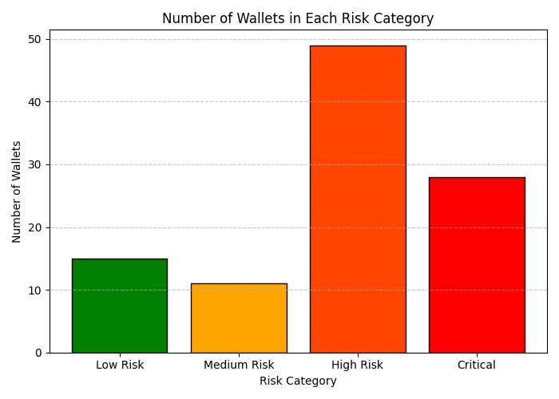

# Analysis Report: Wallet Risk Scoring

## 1. Data Collection Method

The wallet data was collected using the **Covalent API**, specifically the `transactions_v2` endpoint, to retrieve transaction history for each Ethereum wallet. A spreadsheet containing 100 wallet addresses was used as input, and for each address, the API returned details such as:

- Transaction success status
- Transaction value
- Gas used
- Transaction fees
- Timestamps and other on-chain metadata

This method ensured reliable, real-time access to blockchain activity for each wallet while maintaining reproducibility using the API key.

---

## 2. Feature Selection Rationale

From the raw transaction logs, the following engineered features were retained:

- `tx_count`: Number of transactions
- `avg_gas_used`: Mean gas used per transaction
- `avg_tx_value_eth`: Average ETH value transferred
- `total_fees_eth`: Cumulative transaction fees
- `tx_success_rate`: Proportion of successful transactions
- `active_days`: Number of unique days the wallet was active

These features were chosen to capture both the behavioral intensity (frequency, value, activity) and reliability (success rate, gas usage) of wallet interactions on-chain.

---

## 3. Scoring Method

### Step 1: Preprocessing & Scaling

Features were normalized using **MinMaxScaler**, which scaled all feature values to the [0,1] range to ensure fair comparison during clustering.

### Step 2: Clustering with KMeans

Using KMeans with `n_clusters = 4`, wallets were grouped into clusters based on similar transaction behaviors. The cluster with the **lowest average `tx_success_rate_norm`** was identified as the **riskiest cluster**.

### Step 3: Soft Risk Scoring

Each wallet was scored based on its distance from the centroid of the riskiest cluster. A **closer distance indicates higher risk**, and soft scores were assigned using:

```
score = (1 - normalized_distance_to_risky_cluster) * 1000
```

This yields a continuous score from `0` (maximum risk) to `1000` (safest).

---

## 4. Justification of Risk Indicators

The following indicators were central to defining wallet risk:

- **Low transaction success rate**: A direct sign of failed interactions, indicating potentially fraudulent or poorly executed transactions.
- **High gas usage**: May indicate inefficiency or irregular contract usage.
- **Low average transaction value**: Suggests non-serious or spammy wallet behavior.
- **Low activity (days active)**: Less consistent usage can point to non-reliable actors.
- **High cumulative fees with low success**: Reflects inefficient or malicious execution patterns.

These features were aggregated and used for unsupervised clustering to avoid any subjective bias in score assignment.

---

## 5. Output Analysis

### a. Distribution of Wallet Risk Scores

The histogram plot shows that wallet scores are widely distributed between 0 and 1000, with visible peaks near the lower and middle ranges. This suggests that a large portion of wallets exhibit moderate to high risk behaviors, with fewer wallets scoring near the safest end.



---

### b. Wallet Score Trend (Index vs Score)

This line plot reflects the variability of wallet risk scores across the dataset. The high degree of fluctuation implies diverse behaviors, with wallets alternating between high and low scores. It confirms that the scoring mechanism successfully captures differences across wallet profiles.



---

### c. Number of Wallets in Each Risk Category

Wallets were categorized based on their soft scores:
- **Critical**: 0–250
- **High Risk**: 251–500
- **Medium Risk**: 501–750
- **Low Risk**: 751–1000

The bar chart shows that **most wallets fall into the High Risk category**, followed by Critical and Low Risk. Only a small fraction qualify as Medium Risk, indicating a polarization of behaviors.



---

## 6. Scalability

This approach is scalable to thousands of wallets by:
- Batch-fetching transaction logs via API
- Parallel feature extraction pipelines
- Re-using the trained clustering model or applying streaming KMeans for real-time updates
- Continuous scoring of new wallets via distance-to-risk-centroid logic

This modular pipeline can be adapted to multiple chains and protocols with minimal adjustments.

---

